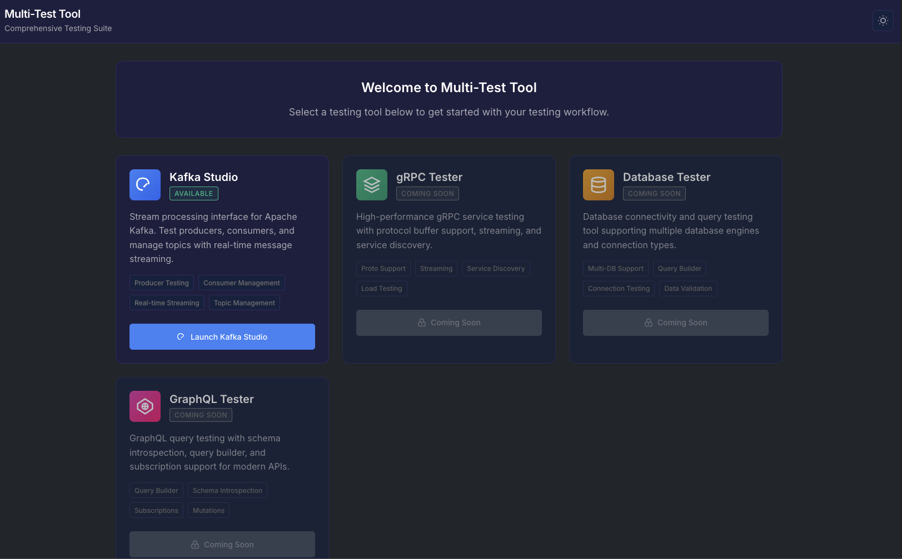

# MicroSuite 🧪

Web-based testing suite for microservices. Unified interface for Kafka, gRPC, GraphQL, and database testing.



## Features

**Available Now:**

-   Kafka producer/consumer testing with real-time streaming
-   Modern web UI with WebSocket updates
-   Message search, filtering, and export
-   Consumer group management
-   Hot-reload development server

**Coming Soon:**

-   gRPC testing with protocol buffer support
-   GraphQL playground with introspection
-   Database connection testing
-   Load testing capabilities

## Quick Start

```bash
git clone https://github.com/sanif/microsuite.git
cd microsuite
uv sync
uv run multi-test-tool-dev
```

Open [http://localhost:5000](http://localhost:5000)

## Configuration

Create `.env` file:

```bash
KAFKA_BOOTSTRAP_SERVERS=localhost:9092
KAFKA_SECURITY_PROTOCOL=PLAINTEXT
WEB_HOST=127.0.0.1
WEB_PORT=5000
```

For secure Kafka:

```bash
KAFKA_SECURITY_PROTOCOL=SASL_SSL
KAFKA_SASL_MECHANISM=SCRAM-SHA-256
KAFKA_SASL_USERNAME=username
KAFKA_SASL_PASSWORD=password
```

## Usage

1. **Kafka Testing**: Navigate to Kafka Studio → configure servers → test connection → send/consume messages
2. **Development**: Use `./dev.py` for auto-reload during development
3. **Production**: Use `uv run multi-test-tool-web` for production deployment

## Development

```bash
uv sync --dev
./dev.py
```

Project structure:

```
src/multi_test_tool/     # Core application
src/templates/           # HTML templates
src/static/             # CSS/JS assets
dev.py                  # Development launcher
```

## TODO

-   [ ] Add Docker support with docker-compose for easy setup
-   [ ] Implement gRPC testing with .proto file upload
-   [ ] Add GraphQL playground with schema introspection
-   [ ] Create REST API testing interface
-   [ ] Add PostgreSQL/MySQL connection testing
-   [ ] Message queue testing (RabbitMQ, Redis)
-   [ ] Load testing with performance metrics
-   [ ] Test scenario automation and scripting
-   [ ] Export test results to various formats
-   [ ] Add authentication/authorization
-   [ ] Kubernetes deployment manifests
-   [ ] Plugin system for custom protocols
-   [ ] Real-time collaboration features
-   [ ] Advanced message routing testing
-   [ ] Integration with CI/CD pipelines

## Contributing

1. Fork → branch → code → test → PR
2. Follow existing code style
3. Add tests for new features

## License

MIT - see [LICENSE](LICENSE)

---

Built by [sanif](https://github.com/sanif) • [sanifss@gmail.com](mailto:sanifss@gmail.com)
